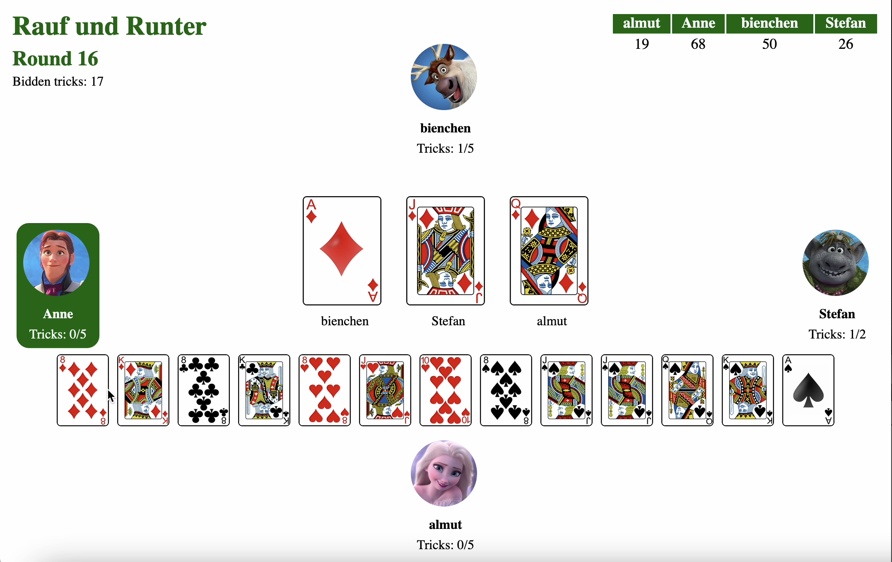

This is my <b>final project</b> for the Python course I took at Beetroot Academy.
I chose to make an online version of a card game I used to play with my family. For development I used Python and Django.

This is what a game looks like:

The next step for this project will be to make it actually asynchronous. At the moment I have a short time solution that works but is not ideal. I use a hidden view that returns a count of changes, meaning every time a player makes a move or something happens in the game, the counter will count up. This view is called once when rendering the game, and then additionally from inside my html template with a timer every second. I then compare the counter values to each other and if they are not equal, the page will be reloaded. Disadvantages with this concept are for one, there is a maximum delay of 1s for every player to be up to date, but most of all this logic causes a lot of traffic on my server since this view function is called every second times four players times currently active game rooms. Which is why the next step would be to replace this concept with websockets that will listen to event streams and update everyone’s pages in real time. For that, I would use Django Channels.
